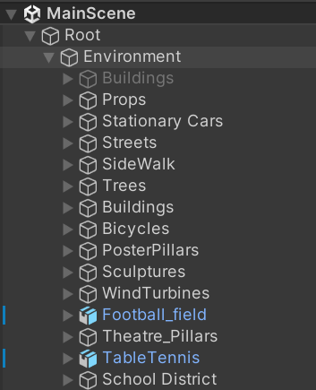
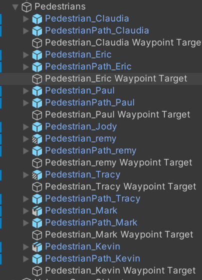
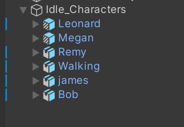

# CIAO's Mixed Reality Driving Simulator

## Mixed Reality Implementation Using Varjo XR-3 and HDRP in Unity

---

## Table of Contents

1. [About](#about)

2. [Project Origin](#project-origin)

3. [Goal of the Project](#goal-of-the-project)

4. [Features](#features)

5. [Tech Stack](#tech-stack)

6. [Environment Setup](#environment-setup)

7. [NPCs](#npcs)

8. [Setup](#setup)

9. [Usage](#usage)

10. [Troubleshooting / Known Issues](#troubleshooting--known-issues)

11. [Demo Video](#demo-video)

12. [Contributions](#contributions)

13. [Acknowledgments](#acknowledgments)

14. [Citation](#citation)

---

## About

We are a Junior Research Group "CIAO" (Computational Interaction and Mobility) at Leipzig University. Our research lies at the intersection of machine learning, human-computer interaction, and mobility. We are part of the Center for Scalable Data Analytics and Artificial Intelligence (ScaDS.AI) Dresden/Leipzig, one of five new AI centers in Germany funded under the federal government’s AI strategy.

This project reflects our interest in advancing mixed-reality applications for mobility research, providing a platform for studying driver-interface interaction in simulated environments. It is designed for researchers, developers, and students interested in exploring human-computer interaction in realistic driving scenarios.

---

## Project Origin

This project is a heavily modified version of a coupled simulator originally developed by Dr. Pavlo Bazilinskyy at TU Eindhoven for research on driver-pedestrian interactions. 

Our adaptation combines a fixed-based driving simulator with a virtual environment into a Mixed-Reality solution powered by the Varjo XR-3 HMD. It features two additional screens (dashboard and IVIS) and has been migrated to the HDRP in Unity. This setup provides a platform for in-depth research on driver-interface interaction under realistic simulated conditions.

---

## Goal of the Project

This project aims to serve as a valuable contribution to the open-source landscape directed at researchers and developers interested in advancing mixed reality applications for mobility and interaction studies. Further contributions, collaborations, and discussions are encouraged to enhance the simulator's capabilities and research applicability.

---

## Tech Stack

**Software:**

- Unity 2022.3.5f1

- Varjo Base \& Varjo Lab Tools

- Steam \& SteamVR

- Varjo SDK for Unity (pre-installed)

- DirectX11

---

## Environment Setup

The simulator replicates a realistic urban environment, integrating roads, buildings, trees, and animated pedestrians. The non-playable characters (NPCs) exhibit a range of behaviors including walking, resting, and interacting to help create a dynamic and immersive scene. This environment provides a great platform for exploration, testing, and observing real-world behaviors.

| Key Components    | Description                                           |
|------------------|-------------------------------------------------------|
| Roads & Sidewalks | Base navigation surfaces for vehicles and pedestrians |
| Pedestrians       | Dynamic agents performing animations                  |
| Parked Vehicles   | Static props affecting realism                       |
| Buildings         | Environmental context                                |
| Wind Turbines     | Background scenery, optional interactive props       |
| Trees             | Decorative elements                                  |

### Hierarchy of the Environment
  

    
  

---

## NPCs

### Pedestrians
  

    
  

### Idle Characters
  

    
  

---

## Setup

### Prerequisites

**Hardware:**

- PC with Windows 10 or 11

- GPU with two ports connected directly (Varjo XR-3 requirement)

- Four SteamVR Base Stations 2.0

- Fixed-Based Driving Simulator (Ergoneers)

---

### Installation \& Running Locally

(*Insert step-by-step installation instructions and pictures here*)

---

## Usage

(*Insert instructions or usage examples here*)

---

## Troubleshooting / Known Issues

### Pedestrians Not Moving

**Problem:** Pedestrians in the scene are not performing animations.  

**Possible Causes \& Fixes:**

1. **Animation Controller Issue**
 - Ensure animations are connected to the **"Entry" Node**.
   - Delete and re-drag animations from the character folder into the Animation Controller.
 - Check **Character's Rig** settings:
    1. Go to **Assets → Models → People → <Character_Name>**. 
    2. Select the character’s .fbx. 
    3. In the **Inspector**, open the **Rig** tab.
        - Animation Type: **Humanoid** 
        - Avatar Definition: **Create From This Model** 
    4. Re-apply these settings. 
    
  - Check **Animation's Rig** settings: 
    1. In the Project window, select the animation 
    2. In the **Rig** tab: 
        - Animation Type: **Humanoid** 
        - Avatar Definition: **Copy From Other Avatar** 
        - Source: The character’s avatar 
    3. Re-apply these settings.

2. **Missing Script**
   - Only affects characters prefixed with **"Pedestrian_"**.  
   - Idle_Characters use Animator only.
   - Compare inspector to reference screenshot to confirm setup.
    

      
    

  **Figure 1**: *This is what the Inspector of your pedestrian should look like. If any scripts are missing, make sure to find them in the project folder and add them to the Inspector. This is also important if you want to add new characters to the scene.*

**Tip:** Multiple pedestrian failures usually indicate a controller problem; single failures may be rig or missing script issues.

---

## Demo Video
(*Insert link or embedded video here*)

---

## Contributions
We welcome contributions! Please fork the repository, make changes, and submit a pull request. Ensure coding standards and documentation are maintained.

---

## Acknowledgments
- ScaDS.AI Dresden/Leipzig, supported under Germany’s AI strategy.
- Original simulator by Dr. Pavlo Bazilinskyy at TU Eindhoven.

---

## Citation
If using this simulator for research, cite:

Bazilinskyy, P., Kooijman, L., Dodou, D., & De Winter, J. C. F. (2020). Coupled simulator for research on the interaction between pedestrians and (automated) vehicles. 19th Driving Simulation Conference (DSC). Antibes, France.

---
