# CIAO's Mixed Reality Driving Simulator

## Mixed Reality Implementation Using Varjo XR-3 and HDRP in Unity

  

    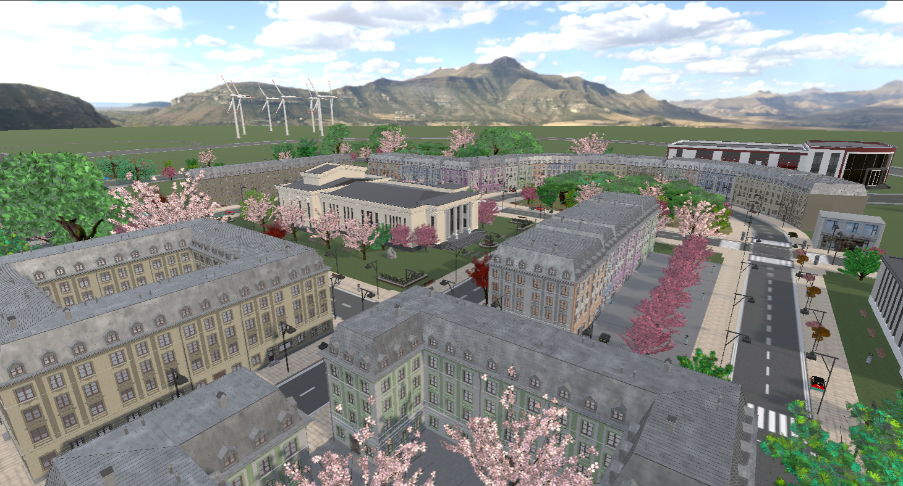
    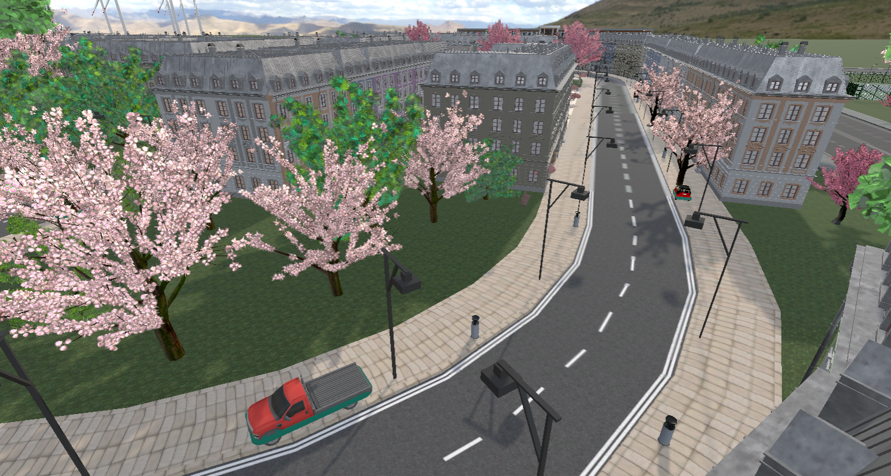
  

---

## Table of Contents

- [About](#about)
- [Environment](#environment)
- [NPCs](#npcs)
- [Dashboard](#dashboard)
- [IVIS](#ivis)
- [AI Driver](#ai-driver)
- [Setup](#setup)
- [Usage](#usage)
- [Troubleshooting / Known Issues](#troubleshooting--known-issues)
- [Demo Video](#demo-video)
- [Contributions](#contributions)
- [Acknowledgments](#acknowledgments)
- [Citation](#citation)

---

## About

We are a Junior Research Group "CIAO" (Computational Interaction and Mobility) at Leipzig University. Our research lies at the intersection of machine learning, human-computer interaction, and mobility. We are part of the Center for Scalable Data Analytics and Artificial Intelligence (ScaDS.AI) Dresden/Leipzig, one of five new AI centers in Germany funded under the federal government’s AI strategy.

This project reflects our interest in advancing mixed-reality applications for mobility research, providing a platform for studying driver-interface interaction in simulated environments. It is designed for researchers, developers, and students interested in exploring human-computer interaction in realistic driving scenarios.

### Project Origin

This project is a heavily modified version of a coupled simulator originally developed by Dr. Pavlo Bazilinskyy at TU Eindhoven for research on driver-pedestrian interactions. 

Our adaptation combines a fixed-based driving simulator with a virtual environment into a Mixed-Reality solution powered by the Varjo XR-3 HMD. It features two additional screens (dashboard and IVIS) and has been migrated to the HDRP in Unity. This setup provides a platform for in-depth research on driver-interface interaction under realistic simulated conditions.

### Goal of the Project

This project aims to serve as a valuable contribution to the open-source landscape directed at researchers and developers interested in advancing mixed reality applications for mobility and interaction studies. Further contributions, collaborations, and discussions are encouraged to enhance the simulator's capabilities and research applicability.

---

## Environment

  

    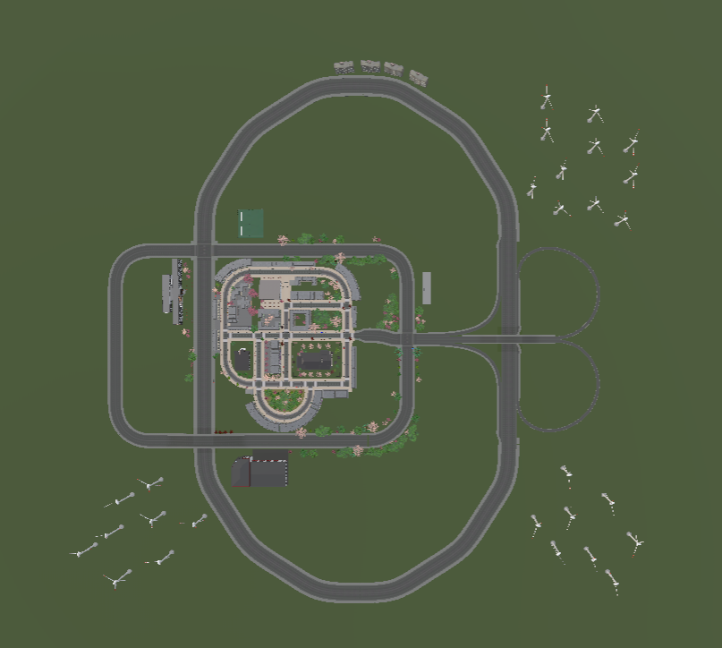
    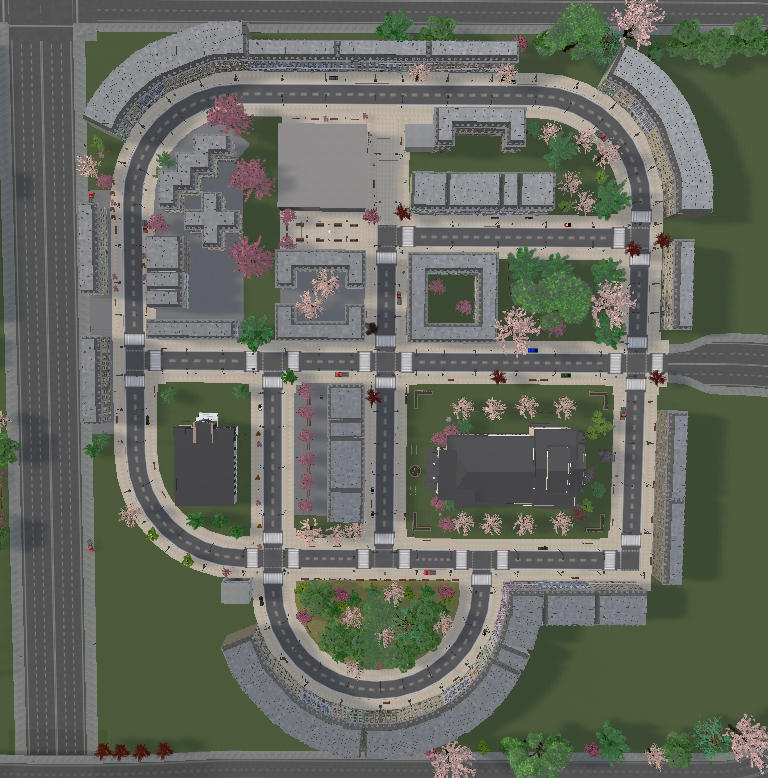
  

The simulator replicates a realistic urban environment, integrating roads, buildings, trees, and animated pedestrians. The basic layout of the roads was adopted 1:1 from the original version of the simulation. Buildings, props, and trees have been adjusted. It features:

- Network of 2-lane roads.
- Loop of 4-lane road (partially surrounded by buildings).
- Loop of 6-lane road (partially surrounded by buildings).
- Half-clover interchange for the motorway.
- 10 intersections, currently without traffic lights (to be re-implemented).
- 34 zebra crossings.
- Static objects (buildings, parked cars, trees).
- Dynamic objects (pedestrians).

### Hierarchy of the Environment
  

    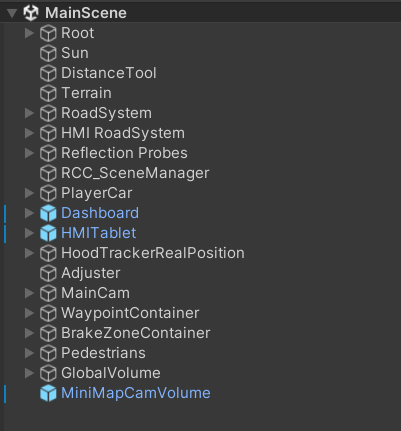
  

---

## NPCs

There are both idle and active pedestrians featured in the scene. The active pedestrians follow their own Waypoint cycles and currently do no have colliders.

---

## Dashboard

  

    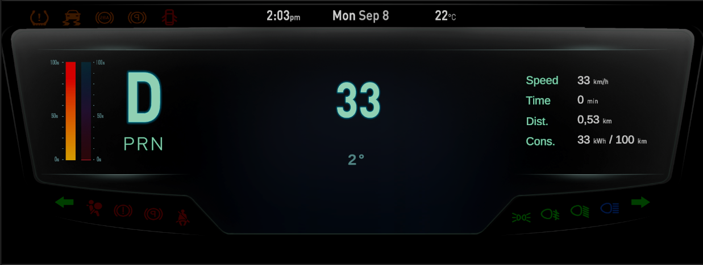
  

The dashboard display shows key driving information:

- Top: Time, date, mock temperature.
- Left side: Brake and throttle input are displayed as vertical bars; Current gear is highlighted, along with inactive gears.
- Center: The steering wheel angle and current speed.
- Right side: Additional driving metrics including speed, elapsed time, distance traveled, and Mock Consumption.

There is a range of buttons, mostly for decoration. Only the left and right blinking icons are mapped to inputs; all shortly light up, then fade out on start up.

---

## IVIS

  

    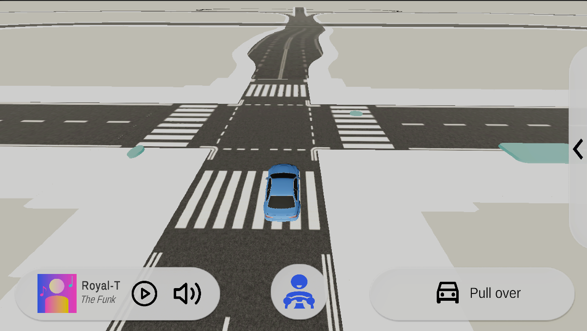
  

  
  The IVIS features a Birds-Eye-View of the Player Car in a simplified environment. Pedestrians and other vehicles are marked in light green. There are buttons to play/pause and mute/unmute music, as well as an assistant button that currently triggers a mock message. The `Pull Over` button is not functional yet.
  
  

    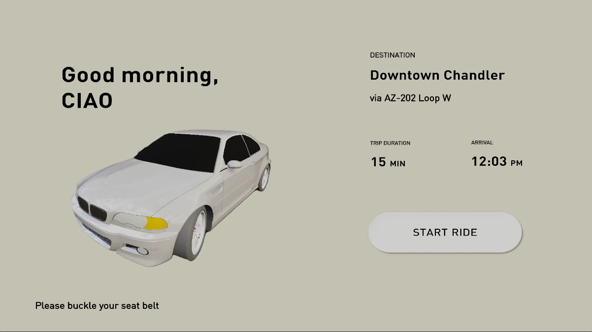
    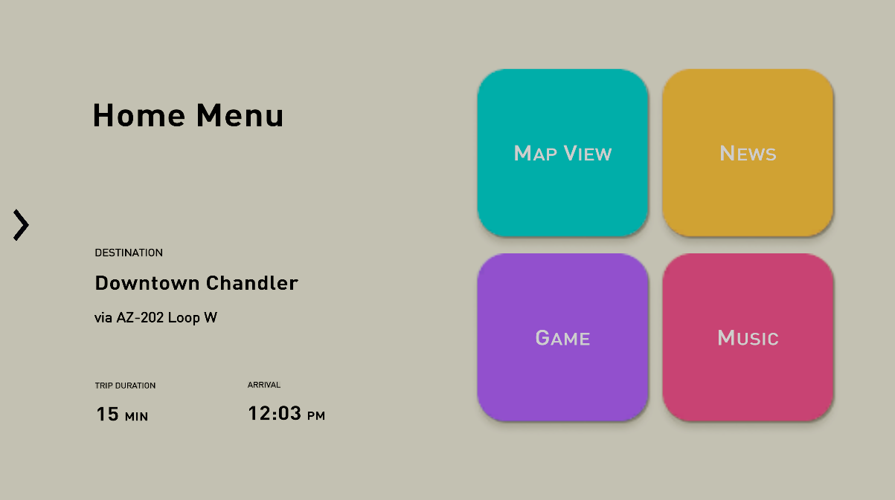
  

  
There are two additional screens: A Start screen, and a Home screen. Clicking buttons will only toggle their visibility.

---

## AI Driver

The player car can either be manually driven, or control can be handed over to an AI driver. The AI driver will follow a Waypoint Cycle (RCC AI driver script), and move the physical steering wheel of the car. The image below shows the currently implement waypoint circuit.

  

    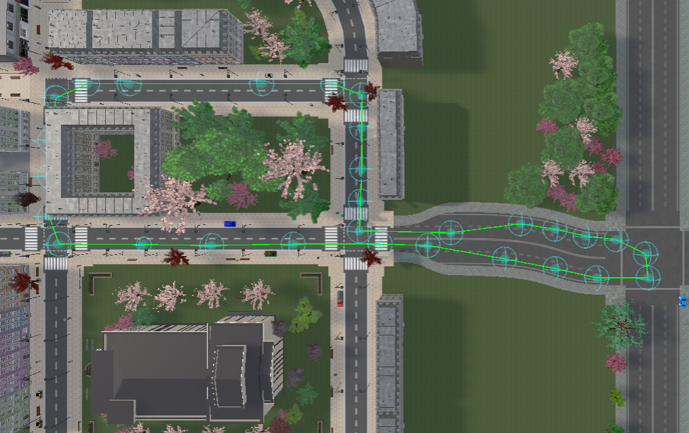
  

## Setup

### Tech Stack

**Software:**

- Unity 2022.3.5f1

- Varjo Base \& Varjo Lab Tools

- Steam \& SteamVR

- Varjo SDK for Unity (pre-installed)

- DirectX11

- vJoy

---

### Prerequisites

**Hardware:**

- PC with Windows 10 or 11

- GPU with two ports connected directly (Varjo XR-3 requirement)

- Four SteamVR Base Stations 2.0

- Fixed-Based Driving Simulator (Ergoneers)

**Software:**

- Realistic Car Controller (Bonecracker Games) -- A license for this asset is needed. You can buy it in the [Unity Asset Store](https://assetstore.unity.com/packages/tools/physics/realistic-car-controller-16296?srsltid=AfmBOorEkki7rHdWpDJJYPRQbDawsVYkARHaRmIliXc-epry_dH2PXpR)

This Simulation was build for use with the Ergoneers Fixed-Based Driving Simulator. If you do not have this, the simulation should be adaptable to run without by modifiying the input system and Mixed-Reality set up.

---

### Varjo Software Installation
1. Install Varjo Base from [Varjo Website](https://developer.varjo.com/downloads#unity-developer-assets).  
2. Download Varjo Lab Tools from Varjo Website.

These applications are essential for managing the headset and configuring the mixed reality settings. 

### Steam and SteamVR

1. Install Steam and SteamVR.
   SteamVR is necessary for utilizing the base stations, which enable motion tracking. Follow the internal instructions for installation and setup.

### Further tracking solutions  

Motion and Hand Tracking can also be done with the Inside-Out-Tracking feauture of Varjo XR-3 (which is still in Beta).   
For this go in Varjo Base to `System`, and enable `Inside-Out-Tracking with Varjo (Beta)`.

### Hardware Connections

1. Connect the Varjo XR-3 headset to your PC/Laptop with the included connector, ensuring you use the [correct ports or adapters](https://varjo.com/use-center/get-started/varjo-headsets/setting-up-your-headset/setting-up-xr-3/) specified for your hardware configuration.

### Varjo and Unity integration
More info is to be found on the [Varjo developer page](https://developer.varjo.com/docs/get-started/get-started).  
Make sure to check all Menu Elements, as navigation on Varjo page isn't very clear.

## Unity Project Configuration

### Varjo SDK installation

Follow the instructions on [Varjo page](https://developer.varjo.com/docs/unity-xr-sdk/getting-started-with-varjo-xr-plugin-for-unity) if Varjo SDK is not already pre-installed or corrupted in the project. You need to install [git](https://git-scm.com/downloads) for it to work. 

Follow all the steps on Varjo Page until the segment about Converting the Main Camera to an XR-Rig.  

#### !Deviation from Varjo Tutorial!

A one-click conversion of our scene is **not possible**, because we have multiple cameras in the scene. 
Here is a detailed instruction how to setup an XR-Rig for Varjo XR-3 when having multiple cameras in the scene:

1. in Unity ➡️ (located at left bottom) `Project` ➡️ `Assets` ➡️ Assets ➡️ Locate the `DrivableCommonObject` using search function. This object is the car model. It is the modified to  integrating the real car model with the virtual car in the virtual driving environment.
   
2. Under `DrivableCommonObject`, navigate to `Driver Logic`, open it up, manually insert an `XR Origin` component by clicking `Right Click` on the mouse ➡️ `XR` ➡️ `XR Origin(Mobile AR)`.

3. Place `XR Origin`-Element under `CameraCounter` in `DriverLogic`.

4. Place existing `Main Camera` and its children under the `XR Origin`. This step makes the Main Camera an XR Origin camera

### Head Tracking Configuration

Now we after placing the Main Camera as a child of XR Origin, we need to implement the head tracking functionality, allowing us to look around and move in the scene. 

1. Click on `Main Camera`, scroll down and click `Add Component`. Search for `Tracked Pose Driver` specifically. NOT `Tracked Pose Driver (Input System)`. As Device choose `Generic XR Device`. As Pose Source choose `Head` or `Center Eye - HMD Reference`.
2. For Tracking Type choose `Rotation only` or `Rotation and Position`. For update type we chose `Update And Before Render`. 

Initially, we set it to track only the rotation. The reason being, that the Inside-Out-Tracking from the Varjo headset didn't allow for really precise and repeatable starting position calculation, because each time the starting point in real world was defined after calibration.
Position tracking will be added once the real car model is integrated, to ensure the virtual and real-world align accurately. This will be done using the SteamVR Basestation 2.0.

If you still decie to track the head position using the Inside-Out-Tracking, adjust the position of the `CameraPositionSet` in the scene. To see how the Camera is placed in the scene, press `#Scene`, left of the `Game` icon at the top middle-right.
As the camera's position is measured relative to the floor it may be necessary to place the origin further down than expected. 

### Post-Processing Bugs

When using the Varjo XR-3 many Post-Processing settings can't be used, as they create visual artifacts in the players filed of view.
Follow the instructions by [Varjo](https://developer.varjo.com/docs/get-started/Post-processing) and disable all the settings listed, which can't be used with Varjo XR-3.
There is a [YouTube video](https://www.youtube.com/watch?v=wuPlruceIRc) by user "FowardX" which could help visualise the issues for our use-case.

### Testing the Setup for VR

With the above configuration, the simulator should now be playable in full VR mode. For it to work correctly run the programms in the following order: 
1. Varjo Base
2. Calibrate Inside-Out-Tracking in Varjo Base.
3. Run the simulation in Unity.
   
Test the setup to ensure that the virtual environment is correctly rendered through the Varjo XR-3 headset and that motion tracking functions as expected.

## Usage

You can run the simulation directly from the editor; however, Unity can only render one display at a time. If you want to make full use of all displays, create a build of the simulation, and run it (since we are still in development, make sure to have "development build" in the build settings checked. It will not correctly build if this is unchecked).

## Eye tracking / Logging

We want to track the point on which the eyes of the user focus, projected on their view of the Mixed-Reality environment.
For this there is a possibility to extract the data from Unity, but that is a non-efficient workaround.  
There is a much better, easier and more visual implementation made directly by Varjo.
On [Varjo's website](https://developer.varjo.com/docs/get-started/gaze-data-collection) you can find an extensive guide on it.
This implementation uses **Varjo Base** Software to record the view from the HMD. The output is a video with the view from the HMD and a point showing where the eyes of the user are looking at. We also get an extensive eye tracking file with multiple variables ranging from  gaze coordinates to quality of eye tracking.

---

## Troubleshooting / Known Issues

### Pedestrians Not Moving

**Problem:** Pedestrians in the scene are not performing animations.  

**Possible Causes \& Fixes:**

1. **Animation Controller Issue**
 - Ensure animations are connected to the **"Entry" Node**.
   - Delete and re-drag animations from the character folder into the Animation Controller.
 - Check **Character's Rig** settings:
    1. Go to **Assets → Models → People → <Character_Name>**. 
    2. Select the character’s .fbx. 
    3. In the **Inspector**, open the **Rig** tab.
        - Animation Type: **Humanoid** 
        - Avatar Definition: **Create From This Model** 
    4. Re-apply these settings. 
    
  - Check **Animation's Rig** settings: 
    1. In the Project window, select the animation 
    2. In the **Rig** tab: 
        - Animation Type: **Humanoid** 
        - Avatar Definition: **Copy From Other Avatar** 
        - Source: The character’s avatar 
    3. Re-apply these settings.

2. **Missing Script**
   - Only affects characters prefixed with **"Pedestrian_"**.  
   - Idle_Characters use Animator only.
   - Compare inspector to reference screenshot to confirm setup.
    

      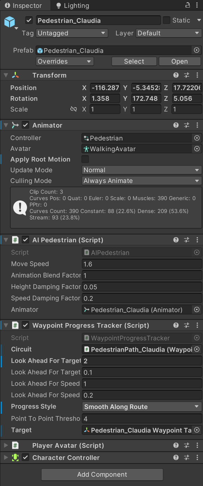
    

  **Figure 1**: *This is what the Inspector of your pedestrian should look like. If any scripts are missing, make sure to find them in the project folder and add them to the Inspector. This is also important if you want to add new characters to the scene.*

**Tip:** Multiple pedestrian failures usually indicate a controller problem; single failures may be rig or missing script issues.

---

## Demo Video
(*to add*)

---

## Contributions
We welcome contributions! Please fork the repository, make changes, and submit a pull request. Ensure coding standards and documentation are maintained.

---

## Acknowledgments
- ScaDS.AI Dresden/Leipzig, supported under Germany’s AI strategy.
- Original simulator by Dr. Pavlo Bazilinskyy at TU Eindhoven.

---

## Citation
If using this simulator for research, cite:

Bazilinskyy, P., Kooijman, L., Dodou, D., & De Winter, J. C. F. (2020). Coupled simulator for research on the interaction between pedestrians and (automated) vehicles. 19th Driving Simulation Conference (DSC). Antibes, France.

---
