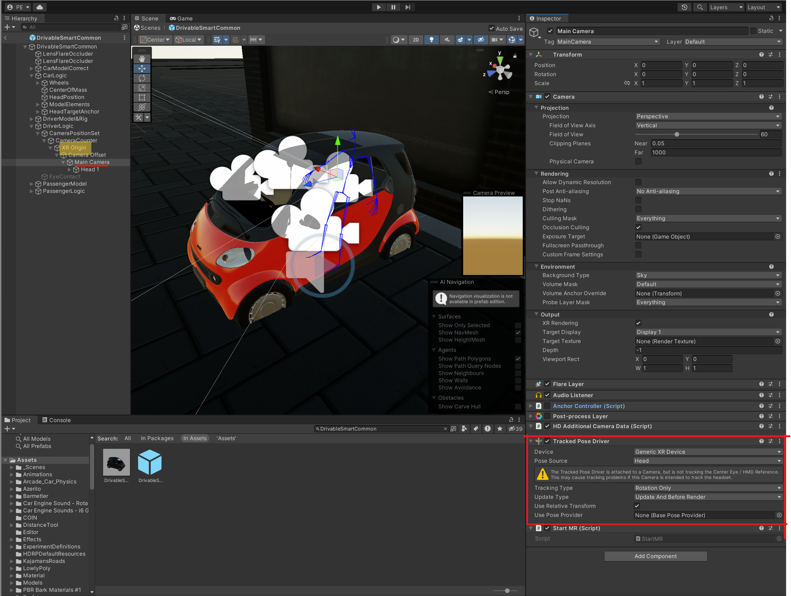

# Mixed Reality Driving Simulation with Varjo XR-3

## Introduction

This project is a modified version of a Coupled simulator for research on driver-pedestrian interactions made in Unity originally developed by Dr. Pavlo Bazilinskyy at TU Eindhoven. 

Our version builds on the original by combining a fixed-based driving simulator with a simulated driving environment into a Mixed-Reality solution powered by Varjo XR-3 HMD.
This adaptation provides a platform for in-depth research into driver-interface interaction within a simulated driving context.

We are a Junior Research Group "CIAO" (Computational Interaction and Mobility) and work at the intersection of machine learning, human-computer interaction, and mobility.
We are part of the Center for Scalable Data Analytics and Artificial Intelligence (ScaDS.AI) at Leipzig University.  
ScaDS.AI Dresden/Leipzig is one of five new AI centers in Germany funded under the federal government’s AI strategy.

This project is open-source and aims to foster a community of researchers and developers interested in advancing mixed reality applications for mobility and interaction studies. 
We encourage contributions, collaborations, and discussions to enhance the simulator's capabilities and applicability in various research domains.

## Project Origin

The original simulation was designed for academic research, offering insights into the interaction between pedestrians and (automated) vehicles.  
We have forked Dr. Bazilinskyy's project and tailored it to meet our specific research needs, adding new features and expanding its use cases.

>## Short overview taken from Dr. Bazilinskyy project on [GitHub](https://github.com/bazilinskyy/coupled-sim/tree/master).
>📺 These days, a video is worth more than a million words. The image below points to a YouTube video of the recording of a demo of the simulator with 3 agents:
>
>
>
>## Environment
>
>
>The coupled simulator supports both day and night-time settings. Figure above shows a view of the night mode. Figures below shows the top view of the environment. It is a model of a US-like city containing:
>- Network of 2-lane roads.
>- Loop of 4-lane road (partially surrounded by buildings).
>- Loop of 6-lane road (partially surrounded by buildings).
>- Half-clover interchange for the motorway.
>- 10 intersections with traffic lights that can be turned on and off before the experiment or programmatically in real-time.
>- 34 zebra crossings.
>- Static objects (buildings, parked cars, trees).
>
><!--  -->
>
>

# Tutorial on Setup and Documentation

## Integration of Varjo XR-3 for Virtual Reality Driving Simulation

We provide step-by-step instructions for setting up and developing a mixed reality driving simulation using the Varjo XR-3 headset. The Varjo XR-3 offers cutting-edge mixed reality (MR) capabilities, combining high-resolution VR-visuals and real-world pass-through view to create immersive MR experiences. Our model leverages these features to simulate driving in a virtual environment while the user is sitting in a real-world fixed-based driving simulator.

## Requirements

**Hardware**:
  - A PC with Windows 10 or Windows 11
  - [Compatible PC](https://varjo.com/use-center/get-started/varjo-headsets/system-requirements/compatible-computers/) fulfilling Varjo requirements
  - GPU with two ports directly connected to it (e.g. 2 HDMI ports leading directly to the GPU). Some Laptops&PCs don't have this feauture. Check Varjo XR-3 Requirements.
  - four SteamVR Basestations 2.0.
  - Fixed-Based Driving Simulator from Ergoneers

**Software**:
  - Varjo Base
  - Varjo Lab Tools
  - Steam and SteamVR
  - Unity Hub
  - Varjo SDK for Unity (pre-installed in the project)
  - Blender 4.0
  - DirectX11
  - Logitech GHub (for pedals and steering wheel, not for real world car) 

## Initial Setup 

>*Taken from the [original project](https://github.com/bazilinskyy/coupled-sim)*
>
>### Input
>The coupled simulator supports a keyboard and a gaming steering wheel as input sources for the driver of the manual car, a keyboard for the passenger of the AV to control the external human->machine interface, and a motion suit or a keyboard for the pedestrian. At the moment, supported motion suit is Xsens Motion Suit.
>
>### Output
>The simulator supports giving output to both a computer screen and a head-mounted display (HMD).
>
>### Installation
>The simulator was tested on Windows 11 and macOS Ventura 13.5. All functionality is supported by both platforms. However, support for input and output devices was tested only on Windows 10.
>
>After checking out this project, launch Unity Hub to run the simulator with the correct version of Unity (currently **2022.3.5f1**).
>
>## Running a project
> When opening this project for the first time, click `Add` and select your entire downloaded folder containing all the project files. In case you have already used this project before, select >the project from the Unity Hub projects list. Wait until the project loads in.
>
>Once the project is loaded into the Unity editor open StartScene scene. You do this by going to the project tab, and clicking on the StartScene icon in the Scenes folder. Now, we will explain >three different ways to run scenes, the locations for the first three steps for running as a host or client correlate with the numbers in the picture below. 
>
>
>
>### Running simulation as a host
>1. Make sure that all three checkboxes (`Hide GUI`, `Run Trial Sequence Automatically`, `Record Videos`) in `NetworkingManager` component on `Managers` game object are unchecked.
>2. Press the Play button to run enter `Play Mode`.
>3. Once in `Play Mode`, press `Start Host` button. 
>4. If needed, wait for clients to join.
>5. Once all clients have connected to the host or in case the host is handling the only participant, select one of the experiments listed under `Experiment` section.
>6. Assign roles to participants in `Role binding` section. If no role is selected, the participant will run a "headless" mode.
>7. Select one of control modes listed under `Mode` section.
>8. Start an experiment with the `Initialise experiment` button - all clients will load selected experiment.
>9. Once all connected clients are ready - the experiment scene is fully loaded on each client, press `Start simulation` button.
>
>### Running simulation as a client
>1. Make sure that all three checkboxes - `Hide GUI`, `Run trial sequence automatically`, `Record videos` (`Managers` (game object) ➡️ `NetworkingManager` (component)), are unchecked.
>2. Press the Play button to run enter `Play mode`.
>3. Once in `Play Mode`, press `Start client` button.
>4. Enter the host IP address. 
>5. Press `Connect`.
>6. Once connected, select one of control modes listed under `Mode` section.
>7. Wait until host starts the simulation.
>   
>### Running simulation with multiple agents on one machine
>1. Run host agent inside of Unity (as described above).
>2. Note the IP address in the console of Unity.
>3. Run other  agents after building them `File` ➡️ `Build And Run`. Connect using the IP address from the (1).
>
>Providing input for multiple agents on one machine is not supported. Input is provided only to the agent, the window of which is selected. This mode is intended for testing/debugging.

### Varjo Software Installation
1. Install Varjo Base from [Varjo Website](https://developer.varjo.com/downloads#unity-developer-assets).  
2. Download Varjo Lab Tools from Varjo Website.

These applications are essential for managing the headset and configuring the mixed reality settings. 

### Steam and SteamVR

1. Install Steam and SteamVR.  
SteamVR is necessary for utilizing the base stations, which enable motion tracking. Follow the internal instructions for installation and setup.

### Further tracking solutions  
Motion and Hand Tracking can also be done with the Inside-Out-Tracking feauture of Varjo XR-3 (which is still in Beta).   
For this go in Varjo Base to `System`, and enable `Inside-Out-Tracking with Varjo (Beta)`.

### Hardware Connections

1. Connect the Varjo XR-3 headset to your PC/Laptop with the included connector, ensuring you use the [correct ports or adapters](https://varjo.com/use-center/get-started/varjo-headsets/setting-up-your-headset/setting-up-xr-3/) specified for your hardware configuration.

### Varjo and Unity integration
More info is to be found on the [Varjo developer page](https://developer.varjo.com/docs/get-started/get-started).  
Make sure to check all Menu Elements, as navigation on Varjo page isn't very clear.

## Unity Project Configuration

### Varjo SDK installation
Follow the instructions on [Varjo page](https://developer.varjo.com/docs/unity-xr-sdk/getting-started-with-varjo-xr-plugin-for-unity) if Varjo SDK is not already pre-installed or corrupted in the project. You need to install [git](https://git-scm.com/downloads) for it to work. 

Follow all the steps on Varjo Page until the segment about Converting the Main Camera to an XR-Rig.  

#### !Deviation from Varjo Tutorial!
A one-click conversion of our scene is **not possible**, because we have multiple cameras in the scene. The cameras in question are the cameras rendering the GUI at the start, and also the Rear Mirrors in the car.   
Here is a detailed instruction how to setup an XR-Rig for Varjo XR-3 when having multiple cameras in the scene:

1. in Unity ➡️ (located at left bottom) `Project` ➡️ `Assets` ➡️ Assets ➡️ Locate the `DrivableCommonObject` using search function. This object is the car model. It is the modified to  integrating the real car model with the virtual car in the virtual driving environment.

2. Under `DrivableCommonObject`, navigate to `Driver Logic`, open it up, manually insert an `XR Origin` component by clicking `Right Click` on the mouse ➡️ `XR` ➡️ `XR Origin(Mobile AR)`.

3. Place `XR Origin`-Element under `CameraCounter` in `DriverLogic`.

4. Place existing `Main Camera` and its children under the `XR Origin`. This step makes the Main Camera an XR Origin camera

### Head Tracking Configuration
Now we after placing the Main Camera as a child of XR Origin, we need to implement the head tracking functionality, allowing us to look around and move in the scene. 

1. Click on `Main Camera`, scroll down and click `Add Component`. Search for `Tracked Pose Driver` specifically. NOT `Tracked Pose Driver (Input System)`. As Device choose `Generic XR Device`. As Pose Source choose `Head` or `Center Eye - HMD Reference`.
2. For Tracking Type choose `Rotation only` or `Rotation and Position`. For update type we chose `Update And Before Render`.
   

Initially, we set it to track only the rotation. The reason being, that the Inside-Out-Tracking from the Varjo headset didn't allow for really precise and repeatable starting position calculation, because each time the starting point in real world was defined after calibration.
Position tracking will be added once the real car model is integrated, to ensure the virtual and real-world align accurately. This will be done using the SteamVR Basestation 2.0.
**This part will be updated soon...**

If you still decie to track the head position using the Inside-Out-Tracking, adjust the position of the `CameraPositionSet` in the scene. To see how the Camera is placed in the scene, press `#Scene`, left of the `Game` icon at the top middle-right.

As the camera's position is measured relative to the floor it may be necessary to place the origin further down than expected. 

### Scripting for Camera Management

After updating our project to a different rendering pipeline, which will be discussed further down below, we have run into a problem, where the `Main Camera` responsible for showing the GUI at the beginning didn't turn off after starting the game.   
To solve this we implemented a short line `PlayerSystem.cs`:

> GameObject.FindWithTag("UICam").SetActive(false);

and then we tagged the starting Main Camera as `UICam`.
This disabled the second main camera when the game loaded and ensures that the simulation uses the XR camera exclusively for the MR experience.

### Post-Processing Bugs
When using the Varjo XR-3 many Post-Processing settings can't be used, as they create visual artifacts in the players filed of view.
Follow the instructions by [Varjo](https://developer.varjo.com/docs/get-started/Post-processing) and disable all the settings listed, which can't be used with Varjo XR-3.
There is a [YouTube video](https://www.youtube.com/watch?v=wuPlruceIRc) by user "FowardX" which could help visualise the issues for our use-case.

### Testing the Setup for VR

With the above configuration, the simulator should now be playable in full VR mode. For it to work correctly run the programms in the following order: 
1. Varjo Base
2. Calibrate Inside-Out-Tracking in Varjo Base.
3. Run the simulation in Unity.
   
Test the setup to ensure that the virtual environment is correctly rendered through the Varjo XR-3 headset and that motion tracking functions as expected.

## Next Steps for Mixed Reality Implementation

In the following section, detailed instructions will be provided on achieving mixed reality with the Varjo XR-3, including configuring the real-world pass-through and integrating the physical car model into the simulation.

# Mixed Reality Implementation Using Varjo XR-3 and HDRP in Unity

## Overview
This segment explains the methodology behind integrating the Varjo XR-3 headset with Unity for mixed reality (MR) applications, specifically using the High Definition Render Pipeline (HDRP).  
There are tutorials on the Varjo page, on how to [create a MR-scene](https://developer.varjo.com/docs/unity-xr-sdk/mixed-reality-with-varjo-xr-plugin), but these lack to provide all-encompassing explanations on how to intergrate a real-world view into the virtual reality world and why we take the steps as shown.

### General approach
When using Unity with Varjo XR-3 one can create Mixed-Reality settings by rendering certain parts of the world from the VR view, and other parts from the built-in camera of the headset. 
When `Varjo Video Pass-through` is enabled, you will see the image from the video pass-through cameras when your application renders 0 in the color buffer. 
That means if an object has RGB(0,0,0) and Alpha-Channel (0), then the surface of the object will be rendered with the view from the real-world cameras. 

We can either make the camera clear, that means make the skies RGBA(0,0,0,0), to make or VR-world appear inside the real-world **OR** we can put a stencil mask on a VR-ingame Object and make it show us the real-world. The pass-through video will be rendered inside the shape of the object.

In our case, we want to have a simulated VR-car and VR-environment in which we drive in, but we want to see our body(especially hands) and the fixed-based driving simulator, with which the user is interacting in the real world.

To achieve this, we have to model our fixed-based driving simulator, insert it into the virtual car and put the stencil mask onto the 3D model of the fixed-based driving simulator.   
This way we combine the VR-World with our fixed-based driving simulator.

**ATTENTION: DRAWBACK:**
Sadly, this approach is only possible using the High Defenition Render Pipeline (HDRP) in Unity, which is not the original Render Pipeline of this driving simulator. 
The reason for this, is that we have to use a shader for the Mixed-Reality material, which allows to export the alpha and write to the depth buffer. This only works with HDRP shaders.

Thus we have to convert this project into HDRP.

### Switching Rendering pipeline to HDRP

In this case we are switching from the Unity's Standard Rendering Pipeline to the High Definition Rendering Pipeline.
As this is a longer processes, here is a [detailed video](https://www.youtube.com/watch?v=mSDD0eCR9Io) from the user "Dary Palasky" on how to do this. 
Follow the HDRP wizard to resolve any further compatibility issues.

General explanation for converting pink textures into normal state: Select faulty materials, change their shader to HDRP’s standard shader. Use `Window` ➡️ `Rendering` ➡️ `HDRP Wizard` ➡️ `Convert Selected Built-In Materials to HDRP` for conversion.

- **Lighting Adjustments in HDRP**: Reduce the maximum allowed reflections to 128/256 to address lighting issues.

### Setting Up Varjo XR Plugin for Unity

1. **Install Varjo XR Plugin**: Follow the instructions in the ["Getting Started with Varjo XR plugin for Unity"](https://developer.varjo.com/docs/unity-xr-sdk/getting-started-with-varjo-xr-plugin-for-unity) documentation.
2. **Configure Varjo XR Plugin Settings**: In Unity, go to `Project Settings` ➡️ `XR Plug-in Management`, select `Varjo`, and disable the `Opaque` option. Here is a [visual explanation by Varjo](https://developer.varjo.com/docs/unity-xr-sdk/mixed-reality-with-varjo-xr-plugin).  

Follow this explanation only until "Using HDRP for Mixed Reality".

### Enabling Video Pass-Through

You will need to write a C#-Script and attach this script to your camera, to activate Video-Pass Through. This is described broadly [here](https://developer.varjo.com/docs/unity-xr-sdk/mixed-reality-with-varjo-xr-plugin).

Go to `Project` ➡️ `Assets` ➡️ Right click on a free space ➡️ `Create` ➡️ `C#-Script`.

Delete everything and paste this in:

>using System.Collections;  
>using System.Collections.Generic;  
>using UnityEngine;  
>using Varjo.XR;  
>  
>public class StartMR : MonoBehaviour  
>{  
>    // Start is called before the first frame update  
>    void Start()  
>    { 
>        VarjoMixedReality.StartRender();  
>    }  
>    // Update is called once per frame  
>    void Update()  
>    {  } } 
>

This starts the rendering before the first frame update.
Now, save this code, as e.g. "StartMR.cs".

1. in Unity ➡️ (located at left bottom) `Project` ➡️ `Assets` ➡️ Assets ➡️ Locate the `DrivableCommonObject` using search function. 
   
2. Under `DrivableCommonObject`, navigate to `Driver Logic` ➡️ `CameraPositionSet` ➡️ `CameraCounter` ➡️ `XR Origin` ➡️ `Camera Offset` ➡️ **`Main Camera`**

3. Stay at `Main Camera` and locate your script like in step one searching by name, e.g. `StartMR.cs` 

4. Pull the `StartMR.cs` script onto the `Main Camera`. This add the script to the GameObject.

### Using HDRP for Mixed Reality

**Configure HDRP Settings**: Ensure you're using a color buffer format with an alpha channel. In `Project Settings > Quality`, under `HDRP`, select your HD Render Pipeline Asset and set the `Color Buffer Format` to R16G16B16A16.

## Configuring 3D-Model of the Mixed-Reality Car 

As described above, we want to render fixed-based driving simulator inside of the virtual car, aligning the window views of the real-world and the virtual reality, so that when looking inside the car we see the fixed-based driving simulator, and when looking outside we see the virtual driving environment.

For this we have to take the 3D-Model of the fixed-based driving simulator, insert and connect it to the virtual car, and then create a stencil mask / material, that we will assign to it, which will render the fixed-based simulator from the Varjo XR-3 built in cameras.

### Combining Fixed-Based driving simulator with VR Car

1. in Unity ➡️ (located at left bottom) `Project` ➡️ `Assets` ➡️ Assets ➡️ Locate the `DrivableCommonObject` using search function. 
   
2. Under `DrivableCommonObject`, navigate to `CarModelCorrect` ➡️ `Group03`. This is the VR Car model.

3. Right Click on `Group03`, press `Export to FBX...`

This file can be imported in Blender 4.0. Import the 3D Model of the fixed-based driving simulator.
We aligned these models to eachother and deleted every part that is redundant. Now the fixed based driving simulator is acting as the front panel of the VR-Car.

After aligning the parts, we export the 3D-model as an FBX-file and import them back into the project under `Unity` ➡️ `Project` ➡️ `Assets`. 

We insert the 3D-Model under `DrivableCommonObject`. Navigate to the inserted 3D-Model, open up, delete everything except the car model itself (like `Camera` or `Light`). Press right click on the 3D-Model, navigate to `Prefab` ➡️ `Unpack Completely`. Now you can delete the original `Group03` under `CarModelCorrect` and replace it with the new updated `Group03` from the newly imported 3D-model. 

### Creating the MR-Material / Stencil Mask

**Material Setup**: Varjo Compositor blends images based on the alpha value. Create a new material with a shader that supports alpha export and depth writing. Use HDRP’s Unlit shader, set Surface Type to Opaque, and Color to RGBA(0,0,0,0). Enable Alpha Clipping if necessary.

1.  `Unity` ➡️ `Project` ➡️ `Assets`, choose `Create` ➡️ click on `Material`. Call it e.g. "MRMaterial"
2. Press on the newly created material,  `Shader` select `HDRP/Unlit`
3. under `Surface Type` select Opaque
4. Enable Alpha Clipping  
 

5. **Assign to Mesh**: Now navigate to the `DrivableCommonObject` ➡️ `CarModelCorrect` ➡️ find the 3D model of the fixed-based driving simulator. Drag and Drop the `MRMaterial` onto the fixed-based driving simulator. This will turn it full-black. When starting the simulation with the Varjo XR-3 headset, this black surface will render from the real-world camera feed.
   

### Overlay Hands over VR-View

1. Start Varjo Lab Tools before starting Unity
2. Press `Edit Mode`
3. In `Video depth testing` ➡️ `Mode` choose `Limited Range` or `Forced Range`
4. Set `Near` to 0,01m ; `Far` to 0,5-0,6m

5. Now start everything as usual. The hands are now overlayed over the VR-Image in the chosen range.  
Make your environment monotone in color and light for better tracking.

## Eye tracking / Logging
We want to track the point on which the eyes of the user focus, projected on their view of the Mixed-Reality environment.
For this there is a possibility to extract the data from Unity, but that is a non-efficient workaround.  
There is a much better, easier and more visual implementation made directly by Varjo.
On [Varjo's website](https://developer.varjo.com/docs/get-started/gaze-data-collection) you can find an extensive guide on it.
This implementation uses **Varjo Base** Software to record the view from the HMD. The output is a video with the view from the HMD and a point showing where the eyes of the user are looking at. We also get an extensive eye tracking file with multiple variables ranging from  gaze coordinates to quality of eye tracking.

## Acknowledgments

This project is part of ScaDS.AI Dresden/Leipzig, supported under the federal government's AI strategy. 
originally developed by Dr. Pavlo Bazilinskyy at TU Eindhoven. 

## Citation

If you utilize this modified simulator for academic purposes, please cite the original work:

> Bazilinskyy, P., Kooijman, L., Dodou, D., & De Winter, J. C. F. (2020). Coupled simulator for research on the interaction between pedestrians and (automated) vehicles. 19th Driving Simulation Conference (DSC). Antibes, France. 

